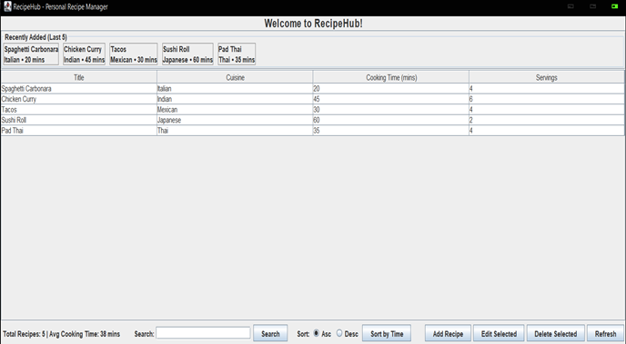

```markdown
# RecipeHub 🍳  
**A Dynamic Personal Recipe Management System**

[](https://www.oracle.com/java/)
[](https://docs.oracle.com/javase/tutorial/uiswing/)
[](LICENSE)
[](https://github.com/yourusername/RecipeHub)

RecipeHub is a **desktop-based personal recipe organizer** built with **Java Swing** following the **Model-View-Controller (MVC)** architecture. It allows users to manage their personal recipe collection with full CRUD operations, real-time updates, smart search, sorting, and a "Recently Added" carousel.

Perfect for home cooks, families, and food enthusiasts who want a simple, offline, privacy-focused recipe manager.

---

## 🌟 Features

- **Full CRUD Operations** – Add, Edit, Delete, and View recipes
- **Real-time Dashboard** – Live updates to table, statistics, and recent panel after every action
- **Recently Added Carousel** – Displays last 5 added recipes using a **Queue** data structure
- **Smart Search** – Linear search with partial matching on **Title** and **Cuisine** (case-insensitive)
- **Sorting** – Sort recipes by cooking time (ascending/descending)
- **Robust Validation** – Prevents empty fields, duplicate titles, negative/invalid numbers with clear error messages
- **Statistics Panel** – Shows total recipes and average cooking time
- **Clean MVC Architecture** – Separation of concerns for maintainability
- **No External Dependencies** – Pure Java with Swing

---

## 📸 Screenshot

### Main Dashboard
  
*Welcome screen with recent recipes, table view, search, sort, and stats*

---

## 🏗️ System Architecture

```
RecipeHub/
├── entity/
│   └── Recipe.java                  ← Recipe entity (POJO)
├── model/
│   └── RecipeModel.java             ← Data management (ArrayList + Queue)
├── controller/
│   └── RecipeController.java        ← Coordinates Model & Views
├── view/
│   ├── MainView.java                ← Main window (table, recent panel, controls)
│   └── AddEditView.java             ← Modal dialog for add/edit with validation
└── RecipeHubApp.java                ← Main class (entry point)
```

**Data Structures Used**:
- `ArrayList<Recipe>` – Main dynamic collection
- `Queue<Recipe>` (LinkedList) – Tracks recently added recipes (max 5)

**Design Pattern**: Model-View-Controller (MVC)

---

## 🚀 Getting Started

### Prerequisites
- Java 17 or higher (JDK)
- Any IDE (NetBeans, IntelliJ IDEA, Eclipse) or command line

### Running the Application

1. Clone the repository:
   ```bash
   git clone https://github.com/yourusername/RecipeHub.git
   cd RecipeHub
   ```

2. Compile and run (using command line):
   ```bash
   javac -d bin src/**/*.java
   java -cp bin RecipeHubApp
   ```

3. Or open in your IDE:
   - Import as a Java project
   - Set `RecipeHubApp` as the main class
   - Run

The application will launch with 5 pre-loaded sample recipes.

---

## 💻 Development & Technologies

- **Language**: Java 17+
- **GUI Framework**: Java Swing
- **Architecture**: MVC Pattern
- **Data Structures**: ArrayList, Queue (LinkedList)
- **Algorithms**: Linear Search (partial match), Comparator-based Sorting
- **IDE Used**: Apache NetBeans

No external libraries required – pure standard Java.

---

## 🧪 Testing

The system includes comprehensive testing covering:
- Functional testing (CRUD, search, sort)
- Input validation (empty fields, invalid numbers, ranges)
- Exception handling (NumberFormatException, duplicates)
- Dynamic UI updates (table, stats, recent panel)

All 30+ test cases passed successfully.

---

## 📝 Future Enhancements

- [ ] File persistence (save/load recipes using serialization or JSON)
- [ ] Recipe images and rich formatting
- [ ] Ingredient-based search
- [ ] Export to PDF / shopping list generation
- [ ] Categories / tags
- [ ] Nutritional information
- [ ] JavaFX port for modern UI

---

## 📄 License

This project is licensed under the **MIT License** – see the [LICENSE](LICENSE) file for details.

---

## 👨‍💻 Author

**Pratyush Pandit**  
- GitHub: [@Pratyushpandit](https://github.com/Pratyushpandit)
- Email: pratyushpandit1@gmail.com

---

**RecipeHub – Cook smarter, organize better.** 🍲✨
